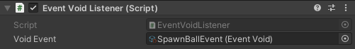
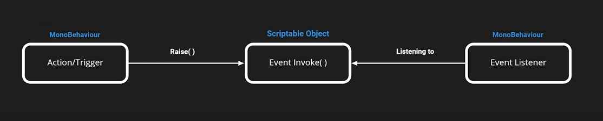

# Scriptable-Events
Quickly setup static events with scriptable objects using the observer pattern. Custom events can also be created.

## How to install
This package can be installed through the Unity `Package Manager` with Unity version 2019.3 or greater.

Open up the package manager `Window/Package Manager` and click on `Add package from git URL...`.


Paste in this repository's url.

`https://github.com/Jason-Skillman/Scriptable-Events.git`


Click `Add` and the package will be installed in your project.

---
**NOTE:** For Unity version 2019.2 or lower

If you are using Unity 2019.2 or lower than you will not be able to install the package with the above method. Here are a few other ways to install the package.
1. You can clone this git repository into your project's `Packages` folder.
1. Another alternative would be to download this package from GitHub as a zip file. Unzip and in the `Package Manager` click on `Add package from disk...` and select the package's root folder.

---

## How to setup
You can create an event by going to `Create/Scriptable Events/<Event Type>` in the `Project` window. Each event is a scriptable prefab. Multible events can be created for your project and different event types exist. Some of the primitive event types include void, int, float, string and bool.

### Subscribing to an event
To subscribe to an event you can attach a method to the `OnInvoked` event in the scriptable object.

This is an example of a monobehavior script subscriping to `EventVoid`. Note: Dont forget to unsubscribe from the event when you no longer need to.

```C#
[SerializeField]
private EventVoid voidEvent;

private void OnEnable() {
	voidEvent.OnInvoked += SpawnBall;
}

private void OnDisable() {
	voidEvent.OnInvoked -= SpawnBall;
}

private void SpawnBall() {
	//Instantiate ball here...
}
```

Drag the scriptable object event into the `EventVoid` variable in the inspector and the game object will subscribe to the event when enabled/start.

```C#
[SerializeField]
private EventVoid voidEvent;
```



### Invoking an event
To trigger an existing event call the `Invoke()` method from the scriptable object. Every subscribed listener will get the fired event.

This is an example of a monobehavior who will trigger the `EventVoid` by calling `Invoke()` when the player enters it's trigger box.

```C#
[SerializeField]
private EventVoid voidEvent;

private void OnTriggerEnter(Collider other) {
    if(!other.CompareTag("Player")) return;

    voidEvent.Invoke();
}
```

### Event diagram



## Creating custom events
If the existing primitive event types are not enough, custom event types can be written. Using the `UnityAction<>` delegate you specify different arguments and data.

Ex. Dictionary event with int as the key and string as the value `UnityAction<int, string>`.

Create a new script which extends `ScriptableObject` and follow a near similar format to the primitive types. Source code examples can be found in `ScriptableEvents/Runtime/Scripts/Events/PrimitiveTypes`.

### EventInt class example
|Property/Method|Description|
|---|---|
|`UnityAction<int>` `OnInvoked`|Event called when the scriptable event is invoked.|
|`Invoke()`|Invokes the event.|

## Supported event types

### Primitive events
- void
- int
- float
- double
- long
- bool
- string

### Primitive array events
- int
- float
- double
- long
- bool
- string

### Unity events
- GameObject
- Scene

## Origin
Original idea was inspired by Unity's `open-project-1` scriptable event system.

Check out the full project here.

https://github.com/UnityTechnologies/open-project-1
